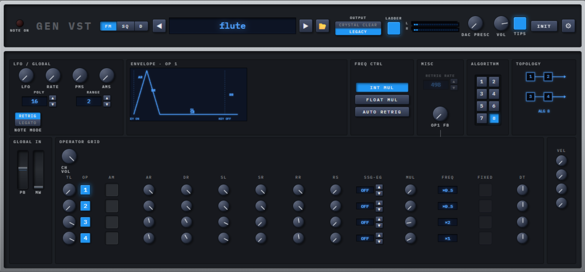

# Gen VST

**The Sega Genesis sound chip, native in your DAW.**

A free, open-source VST3 / AU plugin that emulates the **YM2612** FM chip, the **SN76489** PSG, and the console's gritty 8-bit DAC — three modes per instance, in a modern hardware-VST interface.

[**Download** ↓](https://github.com/binbuf/gen-vst/releases) · [Issues](https://github.com/binbuf/gen-vst/issues) · [Design docs](docs/design/)

    



## Three modes, one engine

Each plugin instance runs **one** of three modes — drop it on a track per sound, like real hardware.

| Mode | Chip / DSP | What it does |
|------|------------|--------------|
| **FM** | `YM2612` (via [ymfm](https://github.com/aaronsgiles/ymfm)) | Six-operator FM synth, 16-voice polyphony. Hardware-style operator grid; all four FREQ CTRL modes (INT / FLOAT / AUTO RETRIG). |
| **SQ** | `SN76489` (via [libvgm](https://github.com/ValleyBell/libvgm)) | 3 tone channels + 1 noise channel. Per-channel ADSR, detune, pan. |
| **D**  | Pure DSP | **Audio FX, not a sampler.** Routes your track's audio through Genesis-style sample-rate decimation + 8-bit quantization + MONO + DRY/WET. |

Two global toggles in the header colour the output: the **Output Filter** models the Model-1 RC lowpass and amp warmth, while the **Ladder Effect** adds the YM2612's stepwise nonlinearity. Flip them on or off independently for either the rounded console sound or the bright-edged chip output.

## Features

- **Authentic emulation.** YM2612 via `ymfm` (BSD-3); SN76489 via the `ValleyBell/libvgm` `sn764xx` core.
- **Tagged unified preset browser.** Drop a `.tfi`, `.vgi`, `.dmp`, `.y12`, `.opm`, `.vgm` bank, or `.psg` file in — the plugin auto-switches to the right mode.
- **Multi-format patch import.** Furnace and DefleMask instruments are first-class citizens; VGM banks too.
- **Modern hardware-VST UI.** 1200×560 dark canvas, IBM Plex Mono, layered shadows. JUCE 8 WebView under the hood — HTML/CSS/JS bundled by Vite, embedded into the plugin binary.
- **Cross-platform.** VST3 on Windows / macOS / Linux. AU on macOS. Standalone everywhere.
- **Validated.** 196 unit tests; verified against `pluginval --strictness-level 8` on Windows VST3.

## Download

Pre-built binaries are on the **[Releases page →](https://github.com/binbuf/gen-vst/releases)**

Or build from source — instructions below.

## Build from source

### Prerequisites

| Tool | Notes |
|------|-------|
| **CMake 3.22+** | Bundled with Visual Studio's *C++ CMake tools for Windows* component, otherwise [cmake.org](https://cmake.org/download/). |
| **C++20 compiler** | MSVC (Windows), Apple Clang (macOS), GCC 11+ or Clang 14+ (Linux). |
| **Node.js + npm** | Vite bundles the WebView UI — [nodejs.org](https://nodejs.org/). |
| **Ninja** | Linux only: `apt install ninja-build`. Windows uses MSBuild; macOS uses Xcode. |
| **Git** | `--recurse-submodules` required for `ymfm` + `libvgm`. |

### Clone

```sh
git clone --recurse-submodules https://github.com/binbuf/gen-vst.git
cd gen-vst
```

### Windows

```powershell
.\build.ps1                 # debug build, deploy to per-user VST3 folder
.\build.ps1 --release       # release build
.\build.ps1 --run           # build + launch Standalone
.\build.ps1 --system        # deploy to system VST3 folder (UAC prompt)
.\build.ps1 --clean         # wipe build/ first
```

If PowerShell execution is blocked on your machine:

```powershell
pwsh -ExecutionPolicy Bypass -File .\build.ps1
```

### macOS / Linux

```sh
./build.sh                  # debug build, deploy to per-user plug-in folder
./build.sh --release        # release build
./build.sh --run            # build + launch Standalone
./build.sh --system         # deploy to system folder (sudo)
./build.sh --clean          # wipe build/ first
```

The script configures CMake with the platform preset, builds the Vite UI bundle, copies factory patches to your per-user data directory, and deploys the plugin to a folder your DAW will scan on next rescan.

### Cross-platform quirks

- **Windows** — uses the WebView2 runtime, which ships with Windows 11 and modern Win10. On older systems the plugin will prompt the user to install the [Evergreen WebView2 Runtime](https://developer.microsoft.com/en-us/microsoft-edge/webview2/).
- **macOS** — uses `WKWebView` (built in). Apple Silicon + Intel both supported through Xcode's universal builds.
- **Linux** — uses WebKitGTK; install `libwebkit2gtk-4.1-dev` (or `-4.0-dev` on older distros). The Ninja generator is required.
- **Audio input in D mode** — the plugin declares an audio input bus. Most DAWs handle this transparently for instrument-with-input plugins; Logic and Pro Tools may require the track to be configured as a multi-output instrument or routed via an aux.

### Tests

```sh
ctest --preset windows-debug --output-on-failure
# or macos-debug / linux-debug / *-release
```

## Where things land

| Item | Windows | macOS | Linux |
|------|---------|-------|-------|
| VST3 (user) | `%LOCALAPPDATA%\Programs\Common\VST3` | `~/Library/Audio/Plug-Ins/VST3` | `~/.vst3` |
| VST3 (system, `--system`) | `%CommonProgramFiles%\VST3` | `/Library/Audio/Plug-Ins/VST3` | `/usr/lib/vst3` |
| AU (user) | — | `~/Library/Audio/Plug-Ins/Components` | — |
| Factory patches | `%LOCALAPPDATA%\GenVst\patches` | `~/Library/Application Support/GenVst/patches` | `~/.local/share/GenVst/patches` |

## How it works

Gen VST is a single C++20 / JUCE 8 plugin with a WebView UI:

- **DSP** — `ymfm::ym2612` × 16 (one channel per instance, see [ADR-0010](docs/design/adr/0010-ymfm-instance-model.md)) for FM; libvgm's `sn764xx` for SQ; pure-DSP decimator + Ladder Effect + Output Filter for D and the shared output bus.
- **Voice management** — 16-voice pool with LRU stealing; Poly / Mono / Unison modes (FM).
- **UI** — HTML/CSS/JS bundled by Vite, embedded in the plugin binary, rendered via `juce::WebBrowserComponent`. The C++ ↔ JS bridge serialises `apvts` parameter changes both ways.
- **Patches** — folder-tree-rooted browser with lazy scanning and a background index; install-time filesystem copy rather than a binary blob in the plugin.

Full design docs (architecture, ADRs, visual spec) live under [`docs/design/`](docs/design/).

## Factory patches

The plugin ships with **39 FM `.tfi` patches** sourced from the Furnace [`tfilib`](https://github.com/tildearrow/furnace/tree/master/instruments/OPN/tfilib) instrument set, plus **12 hand-tuned `.psg` SQ presets**. All factory patches use generic timbre names (`bass.tfi`, `piano.tfi`, `pulse-arp.psg`, …) and contain **no game titles, publisher names, or other trademarked identifiers**. No game-derived patch collections are distributed with this project.

Load additional patches via the in-plugin browser, by dragging a folder onto the plugin window, or by pointing a custom root at any directory tree.

## Acknowledgments

| Library | License | Role |
|---------|---------|------|
| [JUCE 8](https://juce.com/) | GPL v3 (free tier) | Audio plugin framework |
| [ymfm](https://github.com/aaronsgiles/ymfm) | BSD-3-Clause | YM2612 OPN2 emulation |
| [libvgm](https://github.com/ValleyBell/libvgm) | LGPL / BSD | SN76489 PSG emulation |
| [Furnace](https://github.com/tildearrow/furnace) | GPL v3 | VGM / DMP extraction; `tfilib` factory patches |
| [WebView2 SDK](https://developer.microsoft.com/en-us/microsoft-edge/webview2/) | Microsoft proprietary | WebView host on Windows |
| [GoogleTest](https://github.com/google/googletest) | BSD-3-Clause | Unit tests |

Standalone app icon by <a href="https://www.flaticon.com/free-icons/piano" title="piano icons">Smashicons / Flaticon</a>.

## License

Gen VST is released under the **GNU General Public License v3.0**. See [`LICENSE`](LICENSE).
